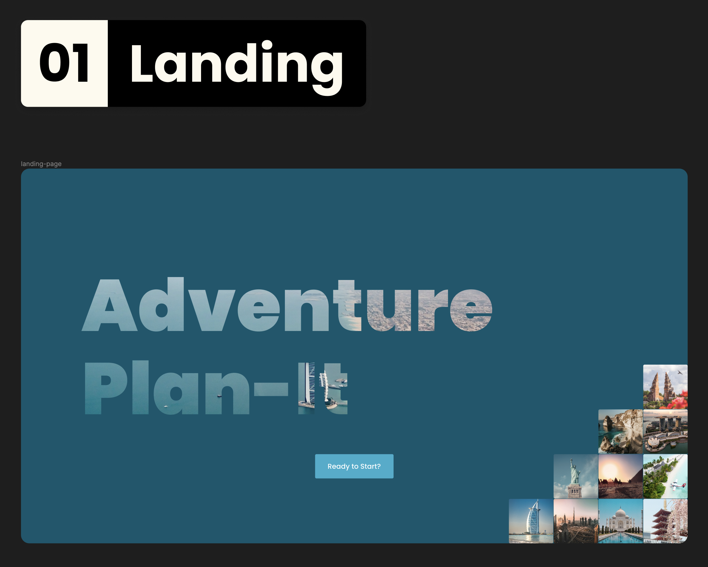
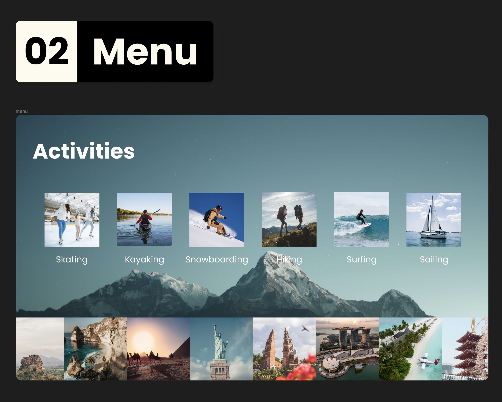
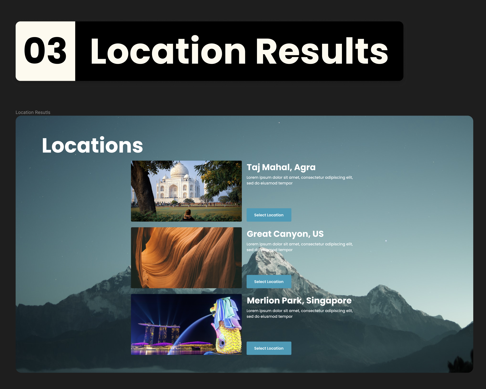
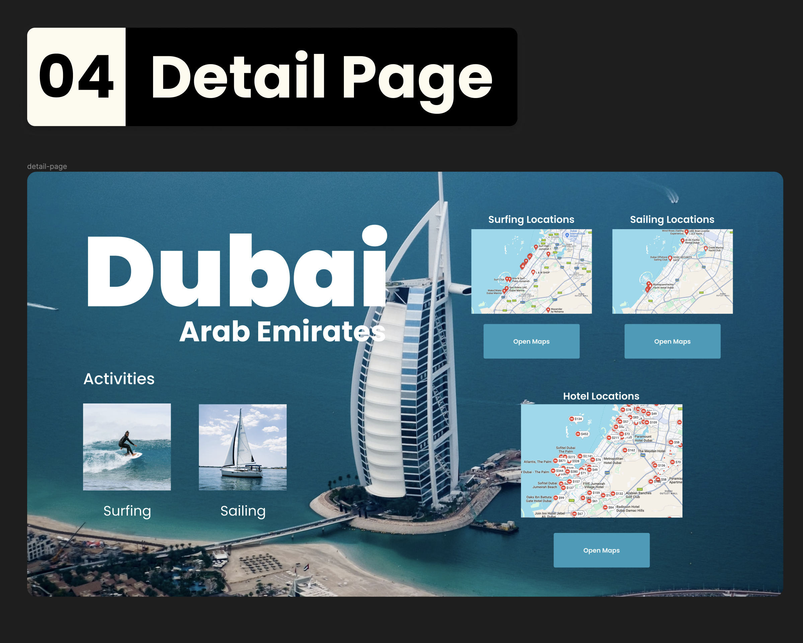

# Project Title
Adventure Plan-It

## Overview

Adventure Plan-It is a place for people who want to start their vacations or in this scenario their adventure with their wanted activities.

### Problem

I have noticed that most travel planners always start with the locations and planning with that in mind. Why not start the travel plan with the activities instead and have options of destinations based on the chosen activities?

### User Profile

- Adventure seekers:
    - looking at destinations based on the activities they want to do

### Features

- As a user, I want to be able to find destination options based on activities I want to do
- As a user, I want to be able to find the closest places for the activities in the destination I have chosen
- As a user, I want to be able to find the highest-rated places for the activities in the destination I have chosen
- As a user, I want to be able to find the closest hotels for the activities in the destination I have chosen
- As a user, I want to be able to find the highest-rated hotels for the activities in the destination I have chosen

## Implementation

### Tech Stack

- React + Vite
- JavaScript 
- MySQL
- Express
- Client libraries: 
    - react
    - react-router
    - axios
- Server libraries:
    - knex
    - express
    - bcrypt for password hashing

### APIs

- No external APIs will be used for the first sprint

### Sitemap

- Landing page
- Activity Menu
- Location Results
- Detail Page

### Mockups

#### Home Page

#### Activity Menu

#### Location Results

#### Detail Page

